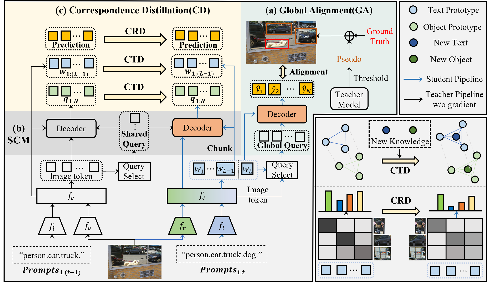

# GCD: Advancing Vision-Language Models for Incremental Object Detection via Global Alignment and Correspondence Distillation
Official Pytorch implementation for "GCD: Advancing Vision-Language Models for Incremental Object Detection via Global Alignment and Correspondence Distillation", AAAI 2025.

<p align='middle'>
  
</p>

## Get Started
- This repo is based on [MMDetection 3.3](https://github.com/open-mmlab/mmdetection). Please follow the installation of MMDetection [GETTING_STARTED.md](https://mmdetection.readthedocs.io/en/latest/get_started.html) and make sure you can run it successfully.
```bash
conda create -n GCD python=3.8 -y
source activate GCD
pip install torch==1.11.0+cu113 torchvision==0.12.0+cu113 torchaudio==0.11.0 --extra-index-url https://download.pytorch.org/whl/cu113
pip install -U openmim
mim install mmengine==0.8.5
mim install mmcv==2.0.0
cd our project
pip install -v -e .
```

## Dataset
- Unzip COCO dataset into data/coco/
- run /script/select_categories_2step.py and select_categories_nstep.py to split the COCO dataset
```python
# Two-step: 
python ./script/select_categories_2step.py  # to generate instances_train2017_0-69.json and instances_train2017_70-79.json
# Multi-step: 
python ./script/select_categories_nstep.py
```

## Train
```python
# assume that you are under the root directory of this project,

# Two-step(70+10)
CUDA_VISIBLE_DEVICES=0,1,2,3 bash ./tools/dist_train.sh ./configs/gdino_inc/70+10/gdino_inc_70+10_0-69_scratch_coco.py 4   # train first 70 cats
CUDA_VISIBLE_DEVICES=0,1,2,3 bash ./tools/dist_train.sh ./configs/gdino_inc/70+10/gdino_inc_70+10_70-79_gcd_scratch_coco.py 4 --amp # train last 10 cats incrementally

# Multi-step(40+20*2)
CUDA_VISIBLE_DEVICES=0,1,2,3 bash ./tools/dist_train.sh ./configs/gdino_inc/40+40/gdino_inc_40+40_0-39_scratch_coco.py 4   
CUDA_VISIBLE_DEVICES=0,1,2,3 bash ./tools/dist_train.sh ./configs/gdino_inc/40+20_2/gdino_inc_40+10_4_40-59_gcd_scratch_coco.py 4 --amp
CUDA_VISIBLE_DEVICES=0,1,2,3 bash ./tools/dist_train.sh ./configs/gdino_inc/40+20_2/gdino_inc_40+10_4_60-79_gcd_scratch_coco.py 4 --amp 
```

## Test
```python
CUDA_VISIBLE_DEVICES=0,1,2,3 bash ./tools/dist_test.sh ./configs/gdino_inc/70+10/gdino_inc_70+10_70-79_gcd_scratch_coco.py ./work_dirs/gdino_inc_70+10_70-79_gcd_scratch_coco/epoch_12.pth 4 --cfg-options test_evaluator.classwise=True
```
