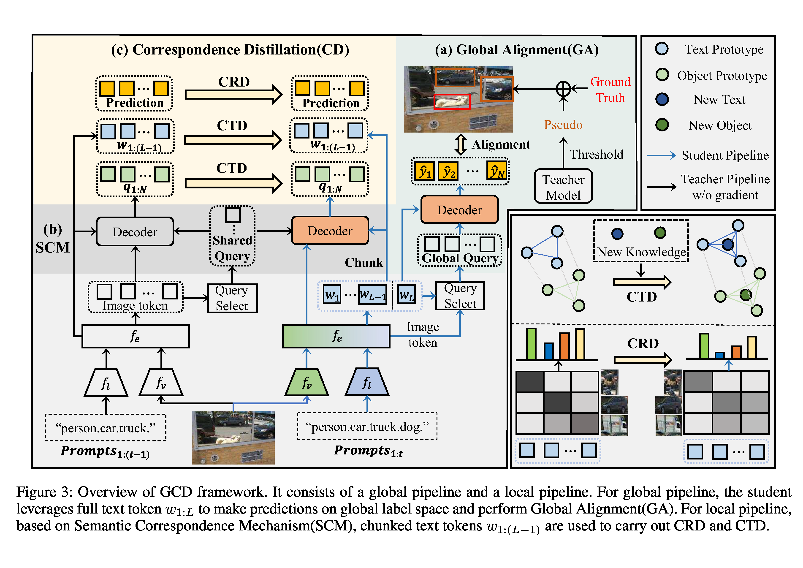

# GCD: Advancing Vision-Language Models for Incremental Object Detection via Global Alignment and Correspondence Distillation
Official Pytorch implementation for "GCD: Advancing Vision-Language Models for Incremental Object Detection via Global Alignment and Correspondence Distillation", AAAI 2025.

[[Paper](https://ojs.aaai.org/index.php/AAAI/article/view/32864)]
[[Appendix](https://github.com/Never-wx/GCD/blob/main/figures/Appendix.pdf)]

## Abstract
Incremental object detection (IOD) is a challenging task that requires detection models to continuously learn from newly arriving data. This work focuses on incremental learning for vision-language detectors (VLDs), an under explored domain. Existing research typically adopts a local alignment paradigm to avoid label conflicts, where different tasks are learned separately without interaction. However, we reveal that this practice fails to effectively preserve the semantic structure. Specifically, aligned relationships between objects and texts would collapse when handling novel categories, ultimately leading to catastrophic forgetting. Though knowledge distillation (KD) is a common approach for tackling this, traditional KD performs poorly when directly applied to VLDs, as for different phases, a natural knowledge gap exists in both encoding and decoding processes. To address above issues, we propose a novel method called Global alignment and Correspondence Distillation (GCD). Differently, we first integrate knowledge across phases within the same embedding space to construct global semantic structure. We then enable effective knowledge distillation in VLDs through a semantic correspondence mechanism, ensuring consistent proposal generation and decoding. On the top of that, we distill teacher model’s informative predictions and topological relationships to maintain stable local semantic structure. Extensive experiments on COCO 2017 demonstrate that our method significantly outperforms existing approaches, achieving new state-of-the-art in various IOD scenarios.

## Approach


## Get Started
- This repo is based on [MMDetection 3.3](https://github.com/open-mmlab/mmdetection). Please follow the installation of MMDetection [GETTING_STARTED.md](https://mmdetection.readthedocs.io/en/latest/get_started.html) and make sure you can run it successfully.
```bash
conda create -n GCD python=3.8 -y
source activate GCD
pip install torch==1.11.0+cu113 torchvision==0.12.0+cu113 torchaudio==0.11.0 --extra-index-url https://download.pytorch.org/whl/cu113
pip install -U openmim
mim install mmengine==0.8.5
mim install mmcv==2.0.0
cd our project
pip install -v -e .
```

## Dataset
- Unzip COCO dataset into ./data/coco/
- Run ./script/select_categories_2step.py and select_categories_nstep.py to split the COCO dataset
```python
# Two-step(40+40): 
python ./script/select_categories_2step.py  # to generate instances_train2017_0-39.json and instances_train2017_40-79.json, which is placed in ./data/coco/annotations/40+40
# Multi-step(40+10*4) trainset:
python ./script/select_categories_nstep_train.py # divide instances_train2017_40-79.json into 4 steps [40-49, 50-59, 60-69, 70-79], which is placed in ./data/coco/annotations/40+10_4
# Multi-step(40+10*4) valset:
python ./script/select_categories_nstep_val.py  # divide instances_val2017.json, the valset is [0-49, 0-59, 0-69, 0-79(original file)]
```

## Train
```python
# assume that you are under the root directory of this project,

# Two-step(70+10)
CUDA_VISIBLE_DEVICES=0,1,2,3 bash ./tools/dist_train.sh ./configs/gdino_inc/70+10/gdino_inc_70+10_0-69_scratch_coco.py 4   # train first 70 cats
CUDA_VISIBLE_DEVICES=0,1,2,3 bash ./tools/dist_train.sh ./configs/gdino_inc/70+10/gdino_inc_70+10_70-79_gcd_scratch_coco.py 4 --amp # train last 10 cats incrementally

# Multi-step(40+10*4)
CUDA_VISIBLE_DEVICES=0,1,2,3 bash ./tools/dist_train.sh ./configs/gdino_inc/40+40/gdino_inc_40+40_0-39_scratch_coco.py 4   
CUDA_VISIBLE_DEVICES=0,1,2,3 bash ./tools/dist_train.sh ./configs/gdino_inc/40+10_4/gdino_inc_40+10_4_40-49_gcd_scratch_coco.py 4 --amp
CUDA_VISIBLE_DEVICES=0,1,2,3 bash ./tools/dist_train.sh ./configs/gdino_inc/40+10_4/gdino_inc_40+10_4_50-59_gcd_scratch_coco.py 4 --amp
CUDA_VISIBLE_DEVICES=0,1,2,3 bash ./tools/dist_train.sh ./configs/gdino_inc/40+10_4/gdino_inc_40+10_4_60-69_gcd_scratch_coco.py 4 --amp
CUDA_VISIBLE_DEVICES=0,1,2,3 bash ./tools/dist_train.sh ./configs/gdino_inc/40+10_4/gdino_inc_40+10_4_70-79_gcd_scratch_coco.py 4 --amp 
```

## Test
```python
CUDA_VISIBLE_DEVICES=0,1,2,3 bash ./tools/dist_test.sh ./configs/gdino_inc/70+10/gdino_inc_70+10_70-79_gcd_scratch_coco.py ./work_dirs/gdino_inc_70+10_70-79_gcd_scratch_coco/epoch_12.pth 4 --cfg-options test_evaluator.classwise=True
```

## Acknowledgement
Our code is based on the project [MMDetection](https://github.com/open-mmlab/mmdetection).
Thanks to the work [ERD](https://github.com/Hi-FT/ERD) and [CL-DETR](https://github.com/yaoyao-liu/CL-DETR).
